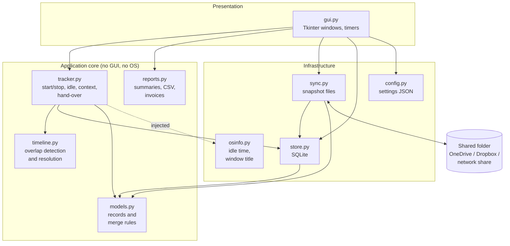
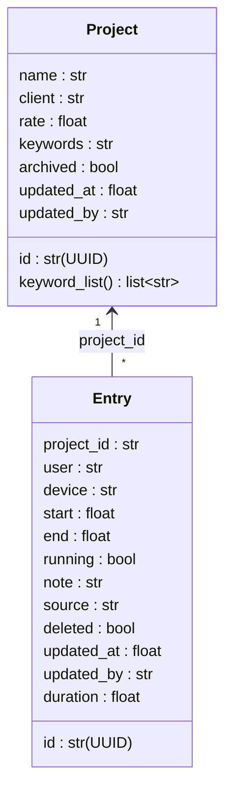
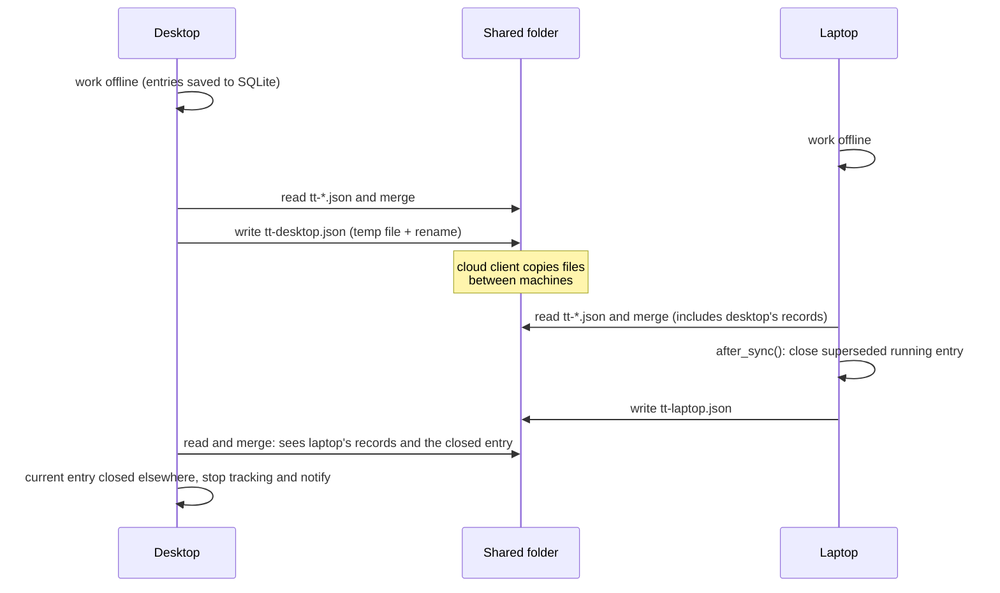
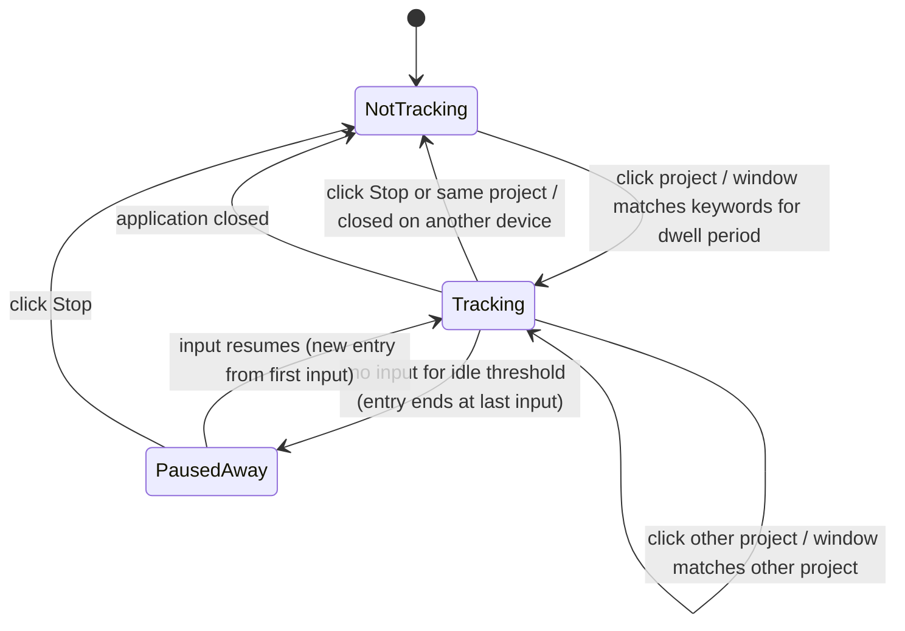
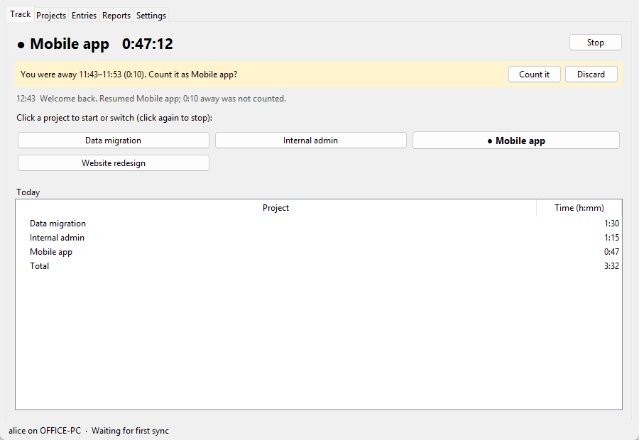
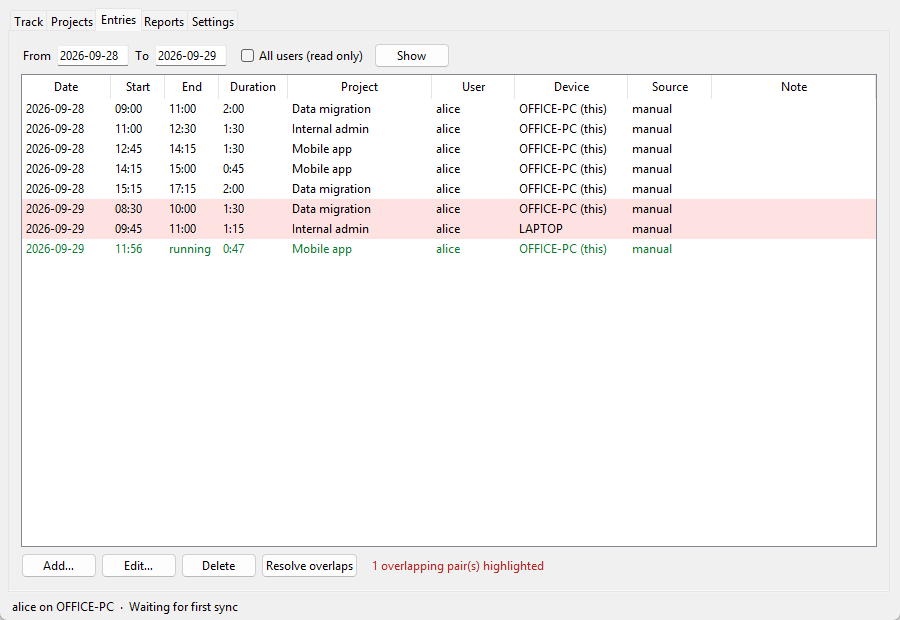
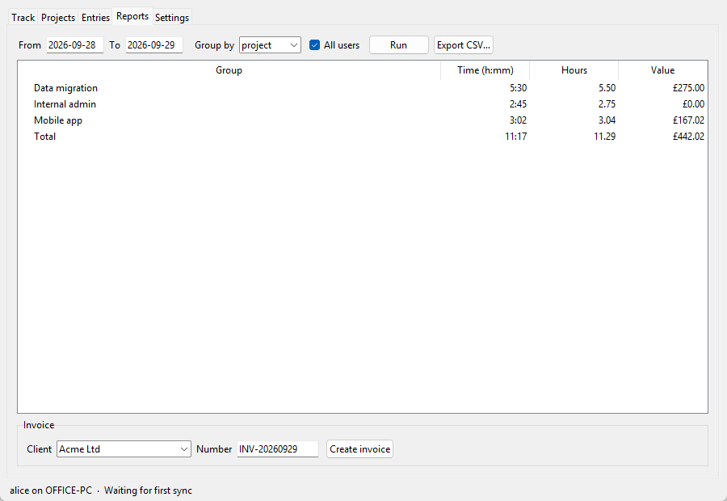
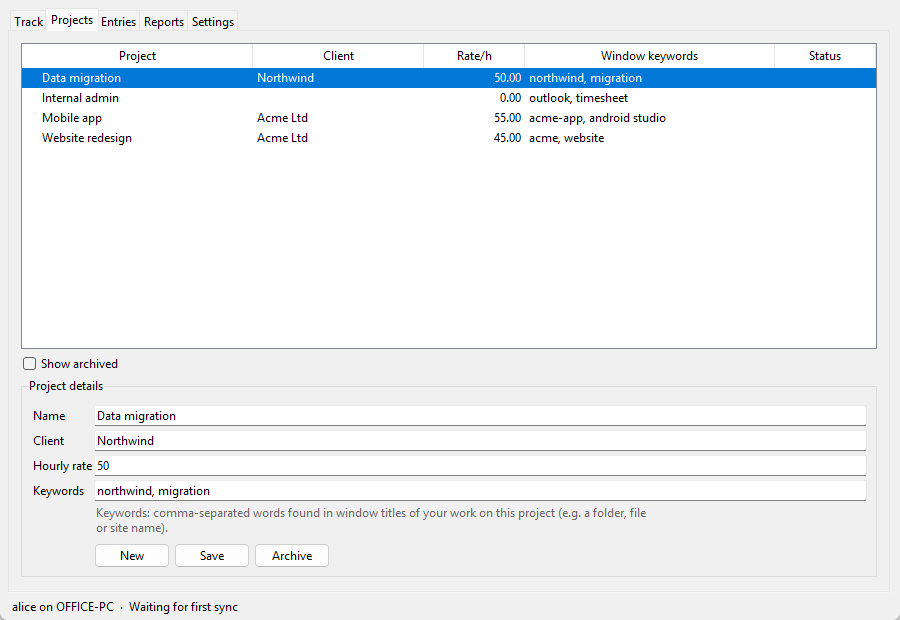

# A Low-Effort Networked Work Time Tracker

**Final Report**

| | |
| --- | --- |
| **Student** | *[Name, student ID]* |
| **Programme** | *[Programme title]* |
| **Supervisor** | *[Supervisor name]* |
| **Second marker** | *[Second marker name]* |
| **Date** | *[Submission date]* |
| **Word count** | *[Insert the figure reported by the draft submission sandpit]* |

---

## Abstract

Professionals who bill clients by the hour depend on accurate records of the time spent on each project. The tools they use share two recognised weaknesses. They demand frequent manual input, which leads users to abandon them, and they cope poorly with one person working on the same project from more than one computer. This project set out to build a time tracker that needs as little user input as possible, records time for multiple projects across multiple computers, and produces reports and invoices from the data.

A desktop application was developed in Python using only the standard library. It runs entirely on the local machine with no server. User effort is reduced by four mechanisms: one-click project switching; idle detection that pauses tracking from the moment of the last input and resumes on return; matching of the active window title against project keywords, which starts or switches projects automatically; and automatic hand-over of tracking between computers. Computers synchronise through any shared folder, such as a cloud drive or network share. Each device writes only its own snapshot file, and records are merged with rules that make the merge commutative, associative and idempotent, following the theory of conflict-free replicated data types. As a result, all devices converge on the same state without a coordinating server.

The system was evaluated with 41 automated tests and three reproducible experiments. In a simulated eight-hour working day across two computers, time was recorded with a total error of 8 seconds (0.03 %) and required no user interactions, compared with nine for an ideal user of a manual timer. A randomised experiment with three devices, 200 trials and 150 operations per trial showed that all devices converged and that every created entry reached every device. Analysis of the merge rule against the formal conditions for convergence found a subtle defect that the randomised experiment had not detected; it was corrected and covered by a new test. Performance measurements led to changes that reduced the cost of a routine synchronisation from 6.1 seconds to 0.04 seconds for 50,000 entries. An evaluation with real users was planned but has not yet been carried out. It is identified as the main outstanding piece of work.

---

## Contents

1. Introduction
2. Background Research and Literature
3. Requirements
4. Design
5. Implementation
6. Testing and Experiments
7. Process and Project Management
8. Critical Evaluation
9. Use of AI and Large Language Models
10. Conclusions and Future Work
11. Evidence of Programme Competencies
12. References

---

## 1. Introduction

### 1.1 Context

In professional services such as consultancy, software development, design and law, time is the product being sold. Each hour must be attributed to the correct project so that each client is charged only for the work done for them, and so that the profitability of projects can be understood. The practical difficulty is that knowledge workers switch between activities and projects frequently, often within minutes (González and Mark, 2004; Meyer *et al.*, 2017). Recording every switch by hand is tedious, and records reconstructed at the end of a day or week from memory are incomplete.

Many commercial time-tracking products exist, but the project brief identifies two weaknesses they share. First, they need too much input from the user, so they end up not being used. Second, they do not cope with a user who works on the same project in two different locations, for example on an office desktop in the morning and a laptop at home in the evening.

### 1.2 Aim

The aim of the project, as agreed in the Project Definition Document (PDD), was:

> To develop and evaluate software that tracks the time a user spends on multiple projects across multiple computers, with significantly less user effort than conventional time-tracking tools, and that produces accurate reports and bills from the data collected.

### 1.3 Objectives

The primary objectives (P) and secondary objectives (S) from the PDD are summarised in Table 1. Section 8 evaluates each one.

*Table 1: Project objectives (from the PDD)*

| ID | Objective |
| --- | --- |
| P1 | Produce a requirements specification based on analysis of existing tools and prospective users. |
| P2 | Design an architecture and data model supporting multi-device tracking and reconciliation. |
| P3 | Implement low-effort time recording for multiple projects on one computer. |
| P4 | Implement synchronisation between computers with no lost records and all overlaps detected. |
| P5 | Implement reporting and billing whose totals match the underlying records exactly. |
| P6 | Evaluate the system against its requirements and against user-effort and accuracy criteria. |
| S1 | Support multiple users, and multiple users per project. |
| S2 | Infer the current project automatically from context. |
| S3 | Run on a single machine without a separately hosted server. |
| S4 | Export data in common formats. |

### 1.4 Summary of outcomes

All primary and secondary objectives were met in software. The exceptions are the parts that need participants: validating requirements with users (P1) and the user study (P6) (Section 8). The final system consists of about 1,510 non-blank lines of application code, 450 lines of tests and 270 lines of experiment scripts. It has no third-party dependencies.

### 1.5 Structure of the report

Section 2 reviews existing products and the research literature, and shows how each influenced the design. Section 3 states the requirements. Sections 4 and 5 present the design and implementation. Section 6 describes the testing and experiments. Section 7 reviews the process, and Section 8 critically evaluates the outcome against the objectives. Section 9 reports the use of AI tools, and Sections 10 and 11 conclude and set out evidence of programme competencies.

---

## 2. Background Research and Literature

### 2.1 Why time records are inaccurate

Studies of information work show that attention is fragmented. González and Mark (2004) observed that workers organise their activity into "working spheres" and switch between them frequently throughout the day, with short periods of uninterrupted work on any one of them. Meyer *et al.* (2017) found similar patterns among software developers, who switch frequently between activities such as coding, meetings and email. When work is fragmented, recording each switch by hand costs effort at exactly the moments when attention is on the switch itself. Mark, Gudith and Klocke (2008) showed that interruptions increase stress and time pressure even when people compensate by working faster. A time tracker that prompts the user frequently is therefore a source of interruptions in its own right.

Two design principles followed from this literature and were carried into the requirements:

1. The tracker should **infer** switches wherever possible, rather than asking the user.
2. When the user's input is needed, it should be **non-modal**. It should be offered and can be ignored, never demanded through a blocking dialog.

### 2.2 Review of existing tools

A range of products was examined, chosen to cover the main approaches in the market (Table 2). The review focused on three properties relevant to the brief: how time is captured, how much user input is required, and how work on multiple devices is handled.

*Table 2: Comparison of representative time-tracking products*

| Product | Capture approach | User input needed | Multi-device support |
| --- | --- | --- | --- |
| Toggl Track (Toggl, n.d.) | Manual start/stop timer; browser and desktop apps | Every start, switch and stop | Cloud account; server-held timer |
| Clockify (CAKE.com, n.d.) | Manual timer and timesheet | Every start, switch and stop | Cloud account |
| Harvest (Harvest, n.d.) | Manual timer and timesheet; invoicing | Every start, switch and stop | Cloud account |
| Timely (Timely, n.d.) | Automatic background capture, later turned into timesheet entries | Review and assign captured activity | Cloud account |
| RescueTime (RescueTime, n.d.) | Automatic application/website categorisation | Low, but productivity-oriented rather than billing | Cloud account |
| WakaTime (WakaTime, n.d.) | Editor plug-ins record coding time per project | None for coding; other work not covered | Cloud account |
| ActivityWatch (ActivityWatch, n.d.) | Open-source, local automatic capture of window and idle ("AFK") events | Low; categorisation rules set by user | Single device; sync under development |
| Kimai (Kimai, n.d.) | Open-source, self-hosted web timesheet | Every start, switch and stop | Requires a hosted server |

Three conclusions were drawn from the review.

- **The market is split between manual and automatic capture.** Manual tools produce billable project time directly, but at the cost of constant input. Automatic tools capture activity cheaply but produce *activity* data. The user must then turn that into *project* time, which moves the effort to the end of the day rather than removing it.
- **Every multi-device solution depends on a central server.** This is usually the vendor's cloud, or a self-hosted server in Kimai's case. A running timer lives on the server, so offline work is either impossible or reconciled in ways the user cannot see. Holding detailed activity data on a third-party server also raises privacy concerns (Section 2.5).
- **ActivityWatch shows that local, automatic capture of window titles and idle state is practical and acceptable to privacy-conscious users.** Its separate "watchers" for window and AFK state directly informed the separation of operating-system hooks from tracking logic in this project (Section 4.2).

The gap identified was a tool that combines **automatic project inference** (not just activity capture) with **server-free, offline-tolerant synchronisation** between a user's devices.

### 2.3 Replication and consistency without a server

Keeping copies of data on several intermittently connected devices is a classic distributed-systems problem. Saito and Shapiro (2005) survey *optimistic replication*: each replica accepts updates locally without coordination and exchanges them later, and conflicts are detected and resolved after the fact. The Bayou system (Terry *et al.*, 1995) applied this to weakly connected mobile devices. Amazon's Dynamo (DeCandia *et al.*, 2007) showed that highly available systems can tolerate temporary divergence provided replicas eventually converge, which Vogels (2009) terms *eventual consistency*.

Shapiro *et al.* (2011) formalised *conflict-free replicated data types* (CRDTs). For a state-based CRDT, replicas exchange whole states and merge them with a function that is **commutative, associative and idempotent**, so that the merged states form a join semilattice. If the merge has these properties, replicas that have received the same updates are guaranteed to be in the same state, whatever the order and number of exchanges. This result underpinned the sync design (Section 4.4). Checking the implementation against it also revealed a defect: an early merge rule was commutative and idempotent but not associative, so devices could fail to converge (Section 6.4).

A common, simple CRDT is the *last-writer-wins (LWW) register*: each value carries a timestamp and the latest wins. Lamport (1978) showed that physical clocks cannot give a reliable ordering of events across machines. LWW with wall-clock timestamps therefore depends on the clocks being reasonably synchronised, which the Network Time Protocol normally achieves on networked computers (Mills, 1991). Hybrid logical clocks (Kulkarni *et al.*, 2014) remove most of this dependency and are discussed as future work.

Kleppmann *et al.* (2019) describe *local-first software*, in which the primary copy of the data lives on the user's own device and the cloud is only a means of transport. They argue that it gives fast response, offline working, longevity and privacy. They also note that general-purpose file-sync services can carry data between devices if the application's file format tolerates concurrent changes. This idea shaped the decision to synchronise through a shared folder rather than a server. Kleppmann (2017) was used as a general reference on replication, clocks and conflict resolution.

### 2.4 Detecting idleness and context

Windows provides `GetLastInputInfo`, which reports the time of the last keyboard or mouse input for the session (Microsoft, n.d.a), and `GetForegroundWindow` with `GetWindowTextW`, which give the title of the active window (Microsoft, n.d.b). ActivityWatch uses equivalent calls. Idle time measured this way has an important property: the moment the user left is known exactly, so tracking can be stopped **retrospectively** at the last input, rather than at the moment the idle threshold expires. The design used this property to make idle handling accurate as well as low-effort.

Window titles usually contain the name of the open file, folder, repository or website, which often identifies the project. Matching titles against user-defined keywords is simpler and more transparent than learning a classifier from activity. It is also easier to explain to users, which matters for trust in any system that observes their activity.

### 2.5 Privacy and legal context

Activity data is personal data under UK GDPR and the Data Protection Act 2018 (UK Government, 2018). The Information Commissioner's Office warns that monitoring workers must be necessary, proportionate and transparent (ICO, 2023). Although the tracker is intended to be used by individuals on their own behalf, the same principles were adopted as design constraints:

- Window titles are examined **in memory only** and are never stored or transmitted.
- All data stays on the user's devices and in a folder they control.
- Automatic switching can be switched off in favour of suggestions.

### 2.6 Usability evaluation

The System Usability Scale (SUS) is a ten-item questionnaire giving a score from 0 to 100 (Brooke, 1996). Sauro (2011) reports an average score of about 68 across a large number of studies, which the PDD adopted as its target. Nielsen's (1994) usability heuristics, particularly "visibility of system status" and "user control and freedom", guided the user-interface design.

### 2.7 How research informed the design

*Table 3: Influence of research on design decisions*

| Finding | Source(s) | Design decision |
| --- | --- | --- |
| Work is fragmented; manual recording is costly and interruptions are harmful | González and Mark (2004); Meyer *et al.* (2017); Mark, Gudith and Klocke (2008) | Automatic switching from window context; non-modal banners instead of dialogs |
| Existing tools either need constant input or produce activity rather than project time | Product review (Table 2) | Map context directly to *projects* through keywords |
| All existing multi-device tools require a server | Product review (Table 2) | Server-free sync through a shared folder |
| A state-based merge must be commutative, associative and idempotent | Shapiro *et al.* (2011) | Merge as a maximum over a total order (Section 4.4) |
| LWW relies on loosely synchronised clocks | Lamport (1978); Mills (1991) | Local edits always supersede the version they edit; clock skew documented as a limitation |
| Local-first data and file-sync transport are practical | Kleppmann *et al.* (2019) | Local SQLite database; one snapshot file per device |
| Last input time is known exactly | Microsoft (n.d.a) | Idle periods removed retrospectively from the moment of last input |
| Monitoring must be proportionate and transparent | ICO (2023) | Titles never stored; suggestion mode; all data local |

---

## 3. Requirements

### 3.1 Sources

Requirements were derived from the project brief, the PDD objectives, and the product and literature review in Section 2. The PDD planned a questionnaire and interviews with prospective users. These have not been carried out (Section 7.3). The requirements should therefore be regarded as analyst-derived, and they are a threat to validity addressed in Section 8.4.

### 3.2 Functional requirements

Requirements were prioritised with the MoSCoW scheme (Must, Should, Could, Won't).

*Table 4: Functional requirements*

| ID | Requirement | Priority | Status |
| --- | --- | :-: | :-: |
| FR1 | Create, edit and archive projects with a client, hourly rate and keywords | M | Met |
| FR2 | Start, switch or stop tracking a project with a single action | M | Met |
| FR3 | Detect idle time, exclude it from the record, and resume on return | M | Met |
| FR4 | Allow time away from the keyboard to be counted with a single action | S | Met |
| FR5 | Synchronise records between computers without a server | M | Met |
| FR6 | Never lose a record during synchronisation, including after offline work | M | Met |
| FR7 | Detect overlapping entries for the same user and resolve them | M | Met |
| FR8 | Hand tracking over automatically when the user starts work on another computer | S | Met |
| FR9 | Add, edit and delete entries manually | M | Met |
| FR10 | Report time and value by project, client, user and day for any date range | M | Met |
| FR11 | Produce an invoice for a client with configurable billing increments | M | Met |
| FR12 | Infer the current project from the active window and switch or suggest | S | Met |
| FR13 | Support several users sharing projects, each able to change only their own entries | S | Met |
| FR14 | Export entries as CSV | C | Met |
| FR15 | Recover from a crash with minimal loss | S | Met |
| FR16 | Mobile application | W | Not in scope |

### 3.3 Non-functional requirements

*Table 5: Non-functional requirements*

| ID | Quality | Requirement |
| --- | --- | --- |
| NFR1 | Reliability | No record is lost in any sequence of offline edits and syncs; all devices converge. |
| NFR2 | Accuracy | Recorded time within 2 % of actual time for a working day (PDD target). |
| NFR3 | Usability | The number of interactions is at least 50 % lower than with a manual timer (PDD target). |
| NFR4 | Deployability | Runs locally with no server and no packages to install. |
| NFR5 | Privacy | Window titles are not stored; data remains on the user's devices and chosen folder. |
| NFR6 | Performance | Routine sync does not noticeably freeze the interface for several years of data. |
| NFR7 | Maintainability | Tracking, sync and reporting logic is independent of the GUI and covered by automated tests. |
| NFR8 | Portability | Runs on any platform with Python 3.10+, with graceful loss of OS-specific features. |

---

## 4. Design

### 4.1 Technology selection

The PDD deliberately left the choice of technology to the project. The candidates were evaluated against weighted criteria taken from the requirements (Table 6). Each candidate was scored from 1 (poor) to 5 (good).

*Table 6: Technology decision matrix (weighted score = Σ weight × score)*

| Criterion (weight) | Python + tkinter + SQLite | Electron (JavaScript) | C# / WPF (.NET) | Local web server (Flask) + browser |
| --- | :-: | :-: | :-: | :-: |
| No server / no install (NFR4) (3) | 5 | 3 | 4 | 2 |
| OS access for idle and window (FR3, FR12) (3) | 4 | 3 | 5 | 3 |
| Offline local storage (2) | 5 | 4 | 5 | 5 |
| Cross-platform (NFR8) (2) | 4 | 5 | 2 | 5 |
| Testability and development speed (2) | 5 | 3 | 4 | 4 |
| Quality of UI (1) | 2 | 5 | 5 | 4 |
| **Weighted total** | **59** | **50** | **54** | **47** |

Python with the standard-library modules `tkinter` and `sqlite3` scored highest. The deciding factor was that the application can be run with a single command on any machine with Python installed, with nothing else to install and no background server to manage. This met the requirement in the code brief that the tracker run locally without a separate server. The main cost was a less modern user interface, and no system-tray integration in the standard library. Both are discussed in Section 8.

SQLite was chosen for local storage because it is an embedded, transactional, single-file database suited to application file formats (SQLite, n.d.). JSON was chosen for sync snapshots because it is human-readable, tolerant of added fields, and supported by the standard library.

### 4.2 Architecture

The system is divided into layers, with dependencies pointing inwards (Figure 1). Only the GUI layer depends on tkinter, and only the `osinfo` adapter depends on the Windows API. The tracking engine takes its clock, idle-time function and window-title function as constructor parameters. This follows the *ports and adapters* style and allows the engine to be tested, and simulated for a whole day, without a GUI or a real operating system.


*Figure 1: Layered architecture. Dashed arrows are dependencies injected at run time.*

### 4.3 Data model

There are two record types (Figure 2). Times are stored as Unix epoch seconds (UTC) and converted to local time only for display, so devices in different time zones agree on the timeline. Every record carries a *version* made up of `updated_at` (a timestamp) and `updated_by` (the identifier of the device that made the change).


*Figure 2: Data model*

Three decisions in the model deserve comment.

- **A running entry stores its last heartbeat in `end`.** While tracking, `end` is updated every 30 seconds. If the application or computer crashes, the entry already has an end time accurate to within one heartbeat, and it is simply closed on the next start (FR15). No separate crash journal is needed.
- **Deletion is a flag (a tombstone), not a row removal.** A deleted entry must stay in the data so that the deletion can spread to other devices. Otherwise another device would copy the entry back.
- **Identifiers are random UUIDs,** so devices can create records independently without coordinating.

### 4.4 Merge semantics

Each device holds a full copy of the data. When copies of the same record differ, the two are merged by choosing one of them whole, the maximum under a fixed total order:

- **Projects:** `(updated_at, updated_by)`, which is last writer wins.
- **Entries:** `(deleted, not running, updated_at, updated_by)`.

The entry ordering gives three rules in priority order. A deleted copy beats any live copy. A closed copy beats any running copy. Otherwise the latest edit wins, with the device identifier breaking exact ties. The second rule is essential for multi-device use. If the laptop closes an entry that the desktop still believes is running, the desktop's next heartbeat has a later timestamp but must not re-open the entry.

The maximum of a total order is commutative, associative and idempotent, so the merged states form a join semilattice. Under Shapiro *et al.* (2011), any two devices that have seen the same records therefore hold identical data. The first version of the rule did not have this property; Section 6.4 describes the defect and its correction.

Two further safeguards deal with clocks:

- **A local edit always supersedes the version it edits.** When a record is saved, its new `updated_at` is the larger of the current time and the previous `updated_at` plus 1 ms. A computer whose clock is slow therefore cannot produce an edit that loses to the version it replaced.
- **Clock skew is a documented limitation.** Concurrent edits made on different devices are still ordered by wall-clock time, so large skew between computers could make an older edit win.

### 4.5 Synchronisation protocol

Synchronisation uses a shared folder as the only transport (Figure 3). Each device:

1. **Imports** every snapshot file `tt-*.json` in the folder and merges its records into the local database.
2. **Resolves** any running-entry conflicts for the current user (Section 4.7).
3. **Exports** its complete state to its own file, `tt-<device-id>.json`, by writing to a temporary file and atomically renaming it.


*Figure 3: Synchronisation between two devices through a shared folder*

This design has several useful properties.

- **No write conflicts.** Each file has exactly one writer, so the file-sync service never has to reconcile concurrent edits to the same file. If it does create a "conflicted copy", the `tt-*` pattern still reads it, and the idempotent merge makes the duplicate harmless.
- **Gossip.** Each snapshot contains everything its device knows, including other devices' records. Records therefore spread even when their original device is switched off.
- **Robust against partial files.** A reader never sees a half-written snapshot, because of the atomic rename. A file that cannot be parsed, such as one still being downloaded, is skipped and retried on the next cycle.
- **Cheap when nothing has changed.** Each device remembers a hash of the contents of every snapshot it has merged. Because merging is idempotent, an unchanged file cannot change anything and is skipped without being parsed (Section 6.5). The contents are hashed, rather than relying on modification times, because file timestamps are coarse on some systems and cloud-sync clients may give a newer file an older timestamp.

The main disadvantage is that each snapshot contains the full history, so its size grows linearly with use. At the measured 274 bytes per entry, ten years of typical use (about 20,000 entries) produces a 5.5 MB file, which modern file-sync services handle easily. Section 10 discusses compaction for larger volumes.

### 4.6 Tracking engine

The tracking engine is a small state machine (Figure 4).


*Figure 4: Tracker states and transitions*

**Idle handling.** On each tick, which happens every two seconds, the engine reads the idle time. If it exceeds the threshold (default five minutes), the current entry is closed at *now − idle*, the moment of last input, not at the moment the threshold was crossed. When input resumes, the same project is restarted from the moment of the first input. The gap is offered in a banner ("You were away 11:43–11:53. Count it as Mobile app?"), and one click converts it into an entry. The default therefore favours not over-billing, and a single click recovers time spent in meetings or on the phone.

**Context matching.** The active window title is matched against every project's keywords. The longest matching keyword wins, so that "acme app" beats "acme". To avoid reacting to brief glances at other windows, a match must persist for a *dwell* period (default 30 seconds) before the engine acts. The switch is then **dated from when the matching window first appeared**, not from when the dwell period ended. It is bounded so that it can never overlap time already recorded (the `_switch_time` method). Two safeguards prevent the automation from fighting the user:

- After a manual stop, automatic restarts for that project are **suppressed** until the matching context changes.
- In suggestion mode, a non-modal banner offers the switch instead of making it.

### 4.7 Overlap resolution and hand-over

A person can only work on one thing at a time, so overlapping entries for one user indicate a conflict. This usually happens when two devices both recorded time, or after a manual edit. Overlaps are detected with a sweep over entries sorted by start time. The Entries tab shows them in red with an explanatory count, rather than by colour alone.

Resolution uses the rule **"latest start wins"**: the user is assumed to have switched to whatever they started most recently. The earlier entry is trimmed to end where the later one starts. If the later entry lies wholly inside the earlier one, the earlier one is split around it.

The tail created by a split receives an identifier derived deterministically from the two entry identifiers, a version 5 UUID. If two devices resolve the same conflict independently, they therefore create the *same* tail record, which the merge then deduplicates, rather than two different records that would overlap again.

The same rule provides automatic **hand-over** between computers (FR8). After each sync, if the user has more than one running entry, every running entry except the most recently started one is closed at the start of that one. The device whose entry was closed notices on its next tick and stops tracking, showing "Tracking moved to LAPTOP: Mobile app". If a split leaves a running continuation on the same device, the engine adopts it seamlessly.

### 4.8 Reporting and billing

Reports clip each entry to the requested date range, so an entry that spans midnight or the edge of the range is counted correctly. They then aggregate by project, client, user or day. Values use each project's hourly rate.

Invoices group a client's time by project. The hours on each line are rounded *up* to the billing increment: six minutes by default, the widely used "tenth of an hour" convention. Each amount is rounded to two decimal places. For example, 50 minutes at £55 per hour is billed as 54 minutes (0.9 hours), which is £49.50.

The invoice is written as a self-contained HTML page, with all text HTML-escaped, and opened in the browser. From there it can be printed to PDF, which avoids depending on a PDF library.

### 4.9 User-interface design

The interface (Figures 5–8) follows the principles set out in Section 2.1.

- **Visibility of system status.** The current project and elapsed time are shown in large type at the top of the Track tab. The status bar shows the user, device and last sync result.
- **One action per intent.** Each project is a button. One click starts or switches to it, and a second click on the running project stops it.
- **Non-modal assistance.** Suggestions and idle-time offers appear as dismissible banners. No dialog ever interrupts the user's work.
- **User control.** Every automatic action is announced in a message line and can be undone by editing the entry.


*Figure 5: Track tab, showing the running project, the idle-time banner and today's totals (demonstration data)*


*Figure 6: Entries tab. Two entries recorded on different computers overlap and are highlighted; the running entry is shown in green.*


*Figure 7: Reports tab, showing time and value by project, with invoice creation*


*Figure 8: Projects tab, where the client, rate and window-title keywords are set*

### 4.10 Security and privacy by design

- Window titles are read, matched in memory and discarded. They are never written to disk or to the sync folder (NFR5).
- No data leaves the user's machines except through a folder the user chooses.
- Users can view other users' entries but can edit or delete only their own. This separation is enforced by the application, not cryptographically: anyone with access to the shared folder can read its JSON files. This is acceptable for an individual or a trusted team, but not for a hostile environment. Section 10 discusses encryption.
- The invoice generator escapes all user-supplied text, so a project name such as `<script>` cannot inject content into the invoice page. A unit test checks this.

---

## 5. Implementation

### 5.1 Overview

The implementation is organised as a Python package, `timetracker`, and is started with `python -m timetracker`. A `--demo` option seeds sample data, and a `--data-dir` option selects the data folder. Two copies of the application can therefore be run on one machine with different data folders and a shared sync folder, to demonstrate synchronisation. Table 7 lists the modules.

*Table 7: Modules and their size (non-blank lines)*

| Module | Lines | Responsibility |
| --- | --: | --- |
| `models.py` | 62 | Record types; merge rules |
| `store.py` | 118 | SQLite persistence; version stamping; bulk merge |
| `sync.py` | 114 | Snapshot import/export; retry; change detection |
| `timeline.py` | 50 | Overlap detection and resolution |
| `tracker.py` | 229 | Tracking engine |
| `reports.py` | 135 | Summaries, CSV, invoices |
| `osinfo.py` | 30 | Windows idle time and window title |
| `config.py` | 45 | Per-device settings |
| `timeutil.py` | 36 | Date and time helpers |
| `gui.py` | 630 | Tkinter user interface |
| `demo.py`, `__main__.py`, `__init__.py` | 65 | Sample data; entry point |
| **Total** | **1,514** | |

All code uses type hints, dataclasses and module docstrings that explain the design rationale. No third-party libraries are used.

### 5.2 Selected implementation details

**Merge rule.** The whole of the merge logic for entries, after the correction described in Section 6.4, is:

```python
def _entry_rank(e: Entry) -> tuple:
    return (e.deleted, not e.running, e.updated_at, e.updated_by)

def merge_entry(a: Entry, b: Entry) -> Entry:
    return a if _entry_rank(a) >= _entry_rank(b) else b
```

Its brevity is deliberate: a rule this small can be reasoned about and tested exhaustively.

**Bulk merge.** `Store.merge_many` loads the local table once into a dictionary. It then merges a whole snapshot inside one transaction and skips records that are already identical. This replaced a per-record query-and-commit loop (Section 6.5).

**Robust rename on Windows.** On Windows, `os.replace` fails with "Access is denied" if another process has the target file open, even briefly. Antivirus scanners, the search indexer and cloud-sync clients all do this routinely. The export therefore retries the rename up to ten times with increasing back-off. If every attempt fails, it removes its temporary file and reports the error in the status bar, and the next sync cycle tries again.

**Operating-system hooks.** `osinfo.py` calls `GetLastInputInfo`, `GetTickCount`, `GetForegroundWindow` and `GetWindowTextW` through `ctypes`. It allows for the 32-bit tick counter wrapping around after 49.7 days. On other platforms both functions return `None`, and the engine treats that as "unknown": idle detection and context matching are disabled, but everything else works.

**GUI timers.** Tkinter is single-threaded. Periodic work is therefore scheduled with `after()`: a tick every 2 seconds, a heartbeat every 30 seconds and a sync every 60 seconds by default. Each timer callback is wrapped so that an unexpected exception is logged without stopping the timer. After the change-detection optimisation, a routine sync takes about 7 ms with 10,000 entries (Section 6.5), so running it on the GUI thread causes no visible pause.

### 5.3 Problems encountered and solved

*Table 8: Implementation problems and solutions*

| Problem | Solution |
| --- | --- |
| `end` is a reserved word in SQL | All column names are quoted in generated SQL |
| A heartbeat from one device could re-open an entry stopped on another | "Closed beats running" in the merge order |
| Duplicate split entries when two devices resolve the same overlap | Deterministic UUIDv5 identifier for split tails |
| An automatic restart immediately after the user pressed Stop | Suppression until the matching context changes |
| Automatic switch lost the dwell period | Switch dated from when the match began (found by experiment, Section 6.3) |
| Merge rule not associative (found by analysis, Section 6.4) | Merge redefined as a maximum over a total order |
| Rename failures on Windows (found by experiment) | Retry with back-off; clean-up of temporary file |
| Sync cost growing with history (found by experiment, Section 6.5) | Bulk merge; skipping snapshot files whose content hash is unchanged |
| Blurred screenshots on high-DPI displays | Process DPI awareness set when capturing figures |

### 5.4 Documentation

User documentation is provided in `README.md`. It covers installation, daily use, setting up multiple computers and multiple users, running the tests, and known limitations. System documentation consists of the module docstrings (which explain each design decision at the point where it is implemented), this report and the experiment scripts.

---

## 6. Testing and Experiments

### 6.1 Strategy

Testing was carried out at three levels:

1. **Automated unit and integration tests** (`tests/`, using the standard `unittest` framework) for every non-GUI module. Sync tests use real files in temporary folders, with several simulated devices each holding its own SQLite database. Tracker tests inject a fake clock, a fake idle-time function and a fake window title, so that hours of behaviour run in milliseconds.
2. **Reproducible experiments** (`experiments/`), which measure properties that assertion-based tests cannot capture well: accuracy and effort over a whole day, convergence under random operations, and performance at scale.
3. **GUI smoke testing.** A script builds the full interface over demonstration data, exercises each tab, tracking, overlap resolution and sync, and checks that no entries are left running after the application closes.

### 6.2 Automated tests

*Table 9: Automated tests*

| Test module | Tests | What is covered |
| --- | --: | --- |
| `test_models.py` | 7 | Merge: last writer wins, commutativity, idempotence, **associativity**, closing and deletion are permanent, tie-breaking |
| `test_sync.py` | 10 | Two-way sync; offline work on both devices; concurrent edits converge; idempotence; corrupt and unsupported files; unchanged-file skipping; same-size rewrites detected; rename retry and give-up with clean-up; device names |
| `test_timeline.py` | 8 | Overlap detection per user; deleted entries ignored; trim; deterministic split; running/running; running tail; equal starts; inputs not mutated |
| `test_reports.py` | 6 | Clipping to range; grouping by project, client and user; rounding; invoice totals and client filter; HTML escaping; CSV |
| `test_tracker.py` | 10 | One-click switch/stop; idle pause, resume and reclaim; context auto-start (dated from first match); no overlap with manual start; longest keyword; brief glances ignored; suggestion mode; no restart after manual stop; crash recovery; cross-device hand-over |
| **Total** | **41** | **All pass** (2.4 s) |

The tests are run with `python -m unittest discover -s tests`. Several tests were added in response to defects and act as regression tests. For example, `test_merge_is_associative` merges three copies of an entry in all six orders and requires a single result; the original merge rule fails it.

### 6.3 Experiment 1: a simulated working day

**Method.** `experiments/scenario.py` replays a scripted working day against the real tracking engine, store and sync code. Time is simulated in 2-second steps, with simulated keyboard activity and window titles. A desktop and a laptop share a sync folder. The script is as follows:

- 09:00–11:00 on the desktop: work on "Web" for 90 minutes, then on "App" for 30 minutes.
- 11:00–11:15: a break.
- 11:15–12:30: work on App.
- 12:30–13:15: lunch.
- 13:15–15:00: work on Web.
- 15:00: the desktop is left running and the user travels home.
- 16:00–17:30 on the laptop: work on App. The user then leaves without stopping anything.

The ground truth is 195 minutes on each project. The simulated user never touches the tracker in automatic mode. In suggestion mode, the user clicks "Switch" whenever a suggestion appears. The baseline is an *ideal* user of a manual timer, who needs nine actions: start, switch, and a stop and restart around every break and the change of computer.

*Table 10: Results of the working-day simulation*

| Measure | Before dating fix | Final | Manual-timer baseline |
| --- | --: | --: | --: |
| Recorded Web (min) | 194.47 | 194.97 | 195 (if perfect) |
| Recorded App (min) | 194.40 | 194.90 | 195 (if perfect) |
| Total error | −68 s (−0.29 %) | **−8 s (−0.03 %)** | 0 if perfect; realistically larger |
| Interactions (automatic mode) | 0 | **0** | 9 |
| Interactions (suggestion mode) | 4 | **4** | 9 |
| Devices hold identical data | Yes | Yes | n/a |

**Findings.**

- **The dwell fix.** The first run showed a systematic loss of about 30 seconds at every automatic switch, because each switch took effect when the dwell period ended rather than when the new window appeared. Dating switches from the first match (Section 4.6) reduced the total error from 68 seconds to 8. The remaining error comes from the 2-second simulation step.
- **Idle detection did the work of the hand-over.** The desktop, left running at 15:00, was closed retrospectively at 15:00 by idle detection, so no cross-device conflict arose. The hand-over mechanism is exercised separately by `test_tracking_hands_over_between_devices`.
- **Interaction counts.** Automatic mode needed no interactions and suggestion mode four, compared with nine for the manual baseline: reductions of 100 % and 56 %. Both exceed the PDD target of 50 %. The one-off cost of entering keywords for each project is not included.

**Threats to validity.** The simulation assumes that window titles identify projects reliably and that the user works continuously during work periods. Real users read documents, attend meetings and use shared tools, such as email, whose titles match no project. Its figures are therefore an upper bound on what automation can achieve. They show that the mechanisms work as designed, not how real users would fare. The user study proposed in Section 8.3 is needed to test that.

### 6.4 Experiment 2: convergence under random operations

**Method.** `experiments/convergence.py` runs 200 trials. In each trial, three simulated devices perform 150 random operations between them:

- creating and editing projects;
- creating entries, some of them running;
- editing entries (simulating heartbeats and note changes);
- closing and deleting entries;
- syncing with the shared folder at random moments.

Operations between one device's syncs happen "offline". At the end of each trial, every device syncs twice. The experiment then checks two properties: that all devices hold identical data (**convergence**), and that every entry ever created exists on every device (**no loss**).

*Table 11: Convergence experiment results (200 trials × 150 operations)*

| Configuration | Converged | No entries lost | Entries created |
| --- | --: | --: | --: |
| First version of the experiment (flawed comparison, see below) | 191 / 200 | 200 / 200 | 8,533 |
| Corrected experiment, original merge rule | 200 / 200 | 200 / 200 | 8,533 |
| Corrected experiment, final code | 200 / 200 | 200 / 200 | 8,533 |

**A flaw in the experiment.** The first version of the experiment reported that 9 of the 200 trials failed to converge. Inspection of a failing trial showed that no record differed between the devices. The experiment compared *ordered lists* of records, and projects were listed in name order. Randomly generated names often repeated, so projects with equal names came out in each database's own row order. The comparison was changed to compare records by identifier, after which every trial converged. The lesson is that a test oracle needs as much scrutiny as the code it tests: a false failure can send debugging in the wrong direction, and a false pass could hide a real defect.

**A defect the experiment did not find.** Independently of the experiment, the merge rule was checked analytically against the three CRDT conditions of Shapiro *et al.* (2011). The original rule took the newer copy and then patched it: if the older copy was closed and the newer copy was running, the result was marked closed and given the older copy's end time. This rule is commutative and idempotent, but **not associative**. Consider three copies of one entry:

- **X:** running, newest version.
- **Y:** closed at 10:05, middle version.
- **Z:** closed at 10:03, oldest version.

Merging (X with Y), then the result with Z, gives an end time of 10:05. Merging (X with Z), then the result with Y, gives 10:03, because the patched result carries X's newer version and so beats Y. Devices that received these copies in different orders would settle on different end times and never converge.

The correction was to make the merge select one copy whole, as the maximum under the order (deleted, closed, version). A maximum is associative by construction. The unit test `test_merge_is_associative` merges the counterexample in all six orders; it fails with the original rule and passes with the final one.

When the corrected experiment was re-run with the original rule substituted, all 200 trials still converged (Table 11). The failure needs one entry to exist in three versions, one running and two closed with different end times, and those versions must reach devices in particular orders. Random operations almost never produce this. Randomised testing therefore gave useful confidence that records are never lost, but it was not a substitute for reasoning about the algebraic properties of the merge. Both were needed.

### 6.5 Experiment 3: performance and scalability

**Method.** `experiments/performance.py` builds a database with 1,000, 10,000 or 50,000 entries and then times four operations:

- exporting a snapshot;
- importing it into an empty database;
- re-merging the same snapshot, as happens after any change on another device;
- the routine case, where nothing has changed.

For scale, 2,000 entries per year is a realistic volume for one person (eight entries a day for 250 days). 50,000 entries therefore represents about 25 years of use, or five years for a team of five.

*Table 12: Sync performance (seconds; Windows 11 laptop, Python 3.13)*

| Entries | File size | Export | First import | Re-merge (before) | Re-merge (after) | Unchanged (before) | Unchanged (after) |
| --: | --: | --: | --: | --: | --: | --: | --: |
| 1,000 | 272 KB | 0.04 | 0.09 | 0.11 | 0.02 | 0.11 | 0.002 |
| 10,000 | 2.7 MB | 0.24 | 0.38 | 1.15 | 0.19 | 1.15 | 0.007 |
| 50,000 | 13.4 MB | 1.94 | 1.62 | 6.11 | 1.01 | 6.11 | 0.038 |

"Before" figures are from the first implementation, in which an unchanged snapshot was re-merged in full, so its two "before" columns are the same measurement. Timings varied by up to about 40 % between runs on the same machine, so the figures indicate orders of magnitude rather than precise costs.

**Findings.** In the first implementation, every routine sync (once a minute) re-parsed and re-merged every snapshot, with one database query per record. For 10,000 entries this froze the interface for over a second every minute, which would have breached NFR6 within about five years of use.

Two changes were made. First, the bulk merge reduced the cost of a genuine re-merge by a factor of about six. Second, a file whose content hash matches the last one merged is skipped, which is safe because merging is idempotent. This reduced the routine case by a factor of about 160 at 50,000 entries; the remaining cost is reading and hashing the file.

An intermediate version detected unchanged files by modification time and size, which took under a millisecond. It was replaced by content hashing because modification times are not a reliable signal of change. File timestamps can be coarse, so a same-size rewrite within one clock tick can go unnoticed, and cloud-sync clients may give a newer file an older timestamp. A few milliseconds of hashing was judged a fair price for correctness. A regression test checks that a same-size rewrite made immediately after a sync is still merged. Export time still grows linearly, but export only runs after local changes and takes about 0.25 seconds at 10,000 entries.

**Discovery of the Windows rename fault.** The first runs of the experiments on Windows failed intermittently with `PermissionError: Access is denied` when a snapshot was renamed into place. This was traced to other processes briefly holding the newly written file open, and led to the retry logic described in Section 5.2.

### 6.6 Summary of defects found by testing

*Table 13: Defects found during testing and evaluation*

| # | Defect | Found by | Severity | Status |
| --- | --- | --- | --- | --- |
| D1 | Merge not associative; devices could fail to converge | Analysis against CRDT conditions | High (breaks NFR1) | Fixed; regression test |
| D2 | Snapshot rename failed intermittently on Windows | Experiments 1–2 on Windows | High (sync fails at random) | Fixed; two tests |
| D3 | Sync cost grew with history and froze the interface | Experiment 3 | Medium (NFR6 over time) | Fixed; test for skipping |
| D4 | ~30 s lost per automatic switch | Experiment 1 | Low (0.3 % error) | Fixed; test updated |
| D5 | Change detection by modification time could miss a rewrite | Review of the D3 fix | Medium (a sync missed until the next change) | Fixed; regression test |
| — | Convergence experiment compared records in list order | Inspection of a reported failure | (Experiment, not product) | Fixed |

All five product defects passed the unit tests that existed at the time. The experiments found three of them. The other two were found by reviewing the design against theory (D1) and against the behaviour of real file systems (D5). The evidence supports using simulation, randomised testing and analytical review together; none of them found every defect alone.

---

## 7. Process and Project Management

### 7.1 Methodology

The PDD specified an iterative, incremental approach in three phases: analysis and design, then four time-boxed construction iterations, then evaluation. The increments were: single-device tracking, then synchronisation, then reporting and billing, then secondary objectives.

In practice, the construction increments were delivered in the planned order, but much faster than planned, because of the extensive use of an AI coding assistant (Section 9). The evaluation phase was then carried out as a series of build–measure–fix loops. Each experiment was run, the defects it revealed were fixed, a regression test was added, and the experiment was run again. Surprising results were investigated before being accepted; one of them turned out to be a flaw in the experiment itself (Section 6.4). This loop was the most productive part of the process.

### 7.2 Tools and practices

- **Version control:** Git, in a single repository holding code, tests, experiments and documents.
- **Testing:** `unittest`, with a fake clock and injected operating-system hooks.
- **Experiments:** stand-alone Python scripts that print their results, so that anyone can reproduce the figures in this report.
- **AI assistance:** Claude Code (Anthropic), described in Section 9.
- **Planning:** the PDD task plan and Gantt chart.

*[Student to complete: the project management software used, and how the plan was kept up to date.]*

### 7.3 Plan versus actual

*[Student to complete from their project log: planned and actual dates for each task in the PDD task plan, with reasons for any differences.]*

Two differences from the plan can be stated from the record of work:

1. The requirements questionnaire and interviews (PDD Task 4) and the user evaluation study (Task 15) have not taken place. Ethical approval for them has not yet been confirmed. As a result, the requirements rest on the brief and the literature, and usability has not been measured with users.
2. Implementation was completed early in the project timeline. That leaves the remaining time available for the user study and for the improvements in Section 10.

### 7.4 Risk review

*Table 14: Review of principal PDD risks*

| PDD risk | Outcome |
| --- | --- |
| R2 Sync harder than expected | Partly materialised: the first merge rule was subtly wrong (D1). It was found by the randomised experiment designed as the mitigation. The early research on CRDTs made the cause quick to diagnose. |
| R3 Unsuitable technology | Did not materialise. The known weaknesses of tkinter (no tray icon, dated appearance) were accepted in the decision matrix. |
| R4 / R5 Participants and ethical approval | Materialised: no participant studies have yet been run. This is the main gap in the evaluation. |
| R8 Access to several machines | Mitigated as planned: devices were simulated with separate data folders on one machine. Testing on physically separate machines over a real cloud-sync service remains to be done. |
| R7 Loss of work | Did not occur; the work is under version control. |

### 7.5 Ethical and legal considerations

No human participants were involved in the work reported here, and no personal data was collected. All test and demonstration data is synthetic, and the names shown in figures ("alice", "Acme Ltd", "OFFICE-PC") are fictitious. The software's design follows the data-protection principles in Section 2.5: window titles are never stored, and data stays under the user's control. Anyone running the planned user study must obtain ethical approval and informed consent first, as set out in the PDD. The study's data must be handled as personal data under UK GDPR.

---

## 8. Critical Evaluation

### 8.1 Against objectives

*Table 15: Evaluation against objectives*

| ID | Status | Evidence and comment |
| --- | --- | --- |
| P1 | Partly met | Requirements specified and prioritised (Section 3), but not validated with prospective users. |
| P2 | Met | Architecture, data model, merge semantics and sync protocol (Section 4); convergence shown experimentally (Section 6.4). |
| P3 | Met | One action or none per switch; idle detection; 0.03 % error in simulation (Section 6.3). |
| P4 | Met | No records lost in 200 randomised trials; all overlaps detected and highlighted; automatic hand-over tested. |
| P5 | Met | Reports and invoices; totals tested exactly against independently calculated values. |
| P6 | Partly met | Technical evaluation complete; user evaluation (SUS, observed effort) not yet carried out. |
| S1 | Met (with caveat) | Multiple users and shared projects; separation enforced by the application, not by authentication. |
| S2 | Met in simulation | Automatic switching and suggestion; the PDD target of 70 % of suggestions accepted needs real users to measure. |
| S3 | Met | Runs with `python -m timetracker`; no server; no packages to install. |
| S4 | Met | CSV export; invoices as HTML that prints to PDF. |

### 8.2 Against the PDD evaluation criteria

*Table 16: Evaluation against the PDD's success criteria*

| Criterion | Target | Result |
| --- | --- | --- |
| Functional completeness | All Must; ≥ 70 % Should | 100 % of Must and Should requirements met (Table 4) |
| User effort | ≥ 50 % fewer interactions than a manual timer | 100 % fewer (automatic) and 56 % fewer (suggestion), **in simulation** |
| Accuracy | ≤ 2 % error per project | 0.03 % total; ≤ 0.05 % per project, **in simulation** |
| Sync correctness | 0 lost records; all overlaps detected | Met (200 / 200 trials; overlap tests) |
| Billing correctness | Exact match | Met (unit tests) |
| Usability | SUS ≥ 68 | **Not yet assessed** |
| Accessibility | No critical WCAG 2.2 AA failures | **Not formally assessed.** Native widgets are keyboard-operable and overlaps are signalled by text as well as colour. A structured audit is needed (W3C, 2023). |

### 8.3 Planned user evaluation

The most significant limitation of this evaluation is the absence of real users. The following study is proposed, subject to ethical approval.

- **Participants:** 8–12 people who work on several projects, such as students with part-time jobs, research staff and freelancers.
- **Procedure:** each participant performs a scripted 30-minute task sequence, with interruptions and a change of computer, twice: once with a manual timer and once with the tracker. The two conditions are presented in counterbalanced order.
- **Measures:**
  - interactions, counted by instrumenting the application;
  - recording error against the scripted timings;
  - SUS score;
  - acceptance rate of suggestions;
  - short interview responses about trust in automatic switching.
- **Field trial:** a one-week trial in participants' real work would test whether keyword matching is reliable when window titles are less predictable.

### 8.4 Appraisal of design decisions

**Shared-folder sync instead of a server.** This decision met the brief's "no separate server" constraint elegantly. Offline working and resilience came as side effects, and the user keeps control of their data.

- *Costs:* it relies on a third-party file-sync service, whose latency (seconds to minutes) sets the speed of hand-over. It also transfers whole snapshots rather than changes.
- *Assessment:* for the data volumes of a time tracker, this was the right trade-off. A server-based design would have met the functional requirements more conventionally, but would have contradicted the brief and the local-first rationale.

**Whole-record last-writer-wins.** Merging whole records is simple and provably convergent, but it resolves *concurrent* edits to different fields of the same entry by discarding one of them. For example, a note added on the laptop can be lost if the desktop changes the project at the same time. Such concurrent edits to the same historical entry are rare in time tracking, so the simplicity was judged worth this cost. Per-field registers would remove it at little extra complexity.

**Wall-clock timestamps.** Relying on synchronised clocks is the most significant theoretical weakness (Lamport, 1978). It is mitigated by NTP, which is on by default on modern operating systems, and by stamping local edits so that they always supersede what they replace. Hybrid logical clocks (Kulkarni *et al.*, 2014) would remove the weakness while keeping timestamps meaningful.

**Keyword matching of window titles.** This is transparent, private and cheap, and it performed perfectly in simulation, but it is only as good as the keywords and titles. It cannot attribute time spent in shared tools such as email or video calls to a project, and a keyword such as "app" could match unintended windows. The longest-match rule, the dwell period and suppression after manual stops reduce errors. Learning associations from the user's corrections, as some automatic trackers do, is a natural next step.

**Python and tkinter.** This choice delivered NFR4 (no install) and excellent testability. It made the simulation experiments possible, and they found all four serious defects. Its weaknesses are presentation and integration: no system-tray icon, no native notifications, and a dated look. For a production release, the core packages could be kept and the GUI layer replaced, which the layered architecture was designed to allow.

### 8.5 Limitations

- Idle detection and context matching are implemented for Windows only.
- There is no user authentication, and sync files are not encrypted.
- Snapshots grow linearly with history, and there is no compaction.
- The application must be running to track time; there is no background service or auto-start.
- Testing on physically separate computers, over a real cloud-sync service, has not been reported.

---

## 9. Use of AI and Large Language Models

*This section is mandatory under the module specification and the University's policy on student use of AI (University of Hull, n.d.). It must be reviewed, completed and confirmed by the student, and it must agree with the separate AI declaration.*

### 9.1 What AI was used for

The AI coding assistant **Claude Code** (Anthropic), using the model **Claude Opus 5.5**, was used throughout the project from within the Visual Studio Code editor. It was given three short prompts, which are stored in the repository as `docs/pdd_prompt.md`, `docs/code_prompt.md` and `docs/report_prompt.md`, together with the project brief and the module specifications. In response it produced:

- a draft of the **Project Definition Document**;
- **all of the application code, the automated tests and the experiment scripts**, including the technology choice and the design described in Sections 4 and 5;
- the **screenshots** in Section 4.9, captured automatically from the running application with demonstration data;
- **this report**, including its diagrams and tables.

The assistant ran the tests and experiments itself, and the results reported here are its actual outputs. When defects D1–D5 and the flaw in the convergence experiment were found, the assistant diagnosed and fixed them and re-ran the experiments. The before-and-after figures in Section 6 come from those runs.

### 9.2 What was verified, and what was not

- **Code behaviour** was verified by execution: the full test suite, the three experiments and a GUI smoke test.
- **Literature and product facts** in Section 2 and the reference list were supplied by the AI from its training data, not retrieved from the sources. Under the University policy, **every reference must be checked against the original before submission**, and any claim that cannot be verified must be removed or corrected. Particular care is needed with specific findings attributed to González and Mark (2004) and Meyer *et al.* (2017), and with product features in Table 2, which change over time.
- **The technology decision matrix** (Table 6) records the AI's judgement. It should be reviewed and, where the student disagrees, revised with reasons.

### 9.3 Reflection

*[Student to complete. Suggested points: which parts of the design the student now understands and can defend in the viva; what was learned by reading and questioning the generated code; whether the student would work differently next time; the extent to which the work can fairly be described as the student's own; and the implications of AI assistance for the programme competencies claimed in Section 11.]*

Two observations can be made from the record. First, the AI's first versions of the merge rule, the sync export, the change detection and the tracker's switching logic all passed their own unit tests, but were wrong in ways that appeared only under simulation, measurement or analytical review. Second, the AI's own experiment initially produced a misleading result (Section 6.4), which was caught only because a surprising figure was investigated rather than reported. AI-generated code, tests and evaluations all need independent, sceptical checking.

---

## 10. Conclusions and Future Work

### 10.1 Conclusions

A time tracker was developed that addresses both weaknesses identified in the brief. User effort is reduced to zero or near zero in normal work, by combining retrospective idle detection, context matching of window titles and automatic hand-over between computers. Work across several computers is supported without any server, by exchanging snapshot files through a folder the user already has. A merge function designed as a join semilattice guarantees that every device converges on the same data.

Reports and invoices are produced directly from the records, and their totals are verified by tests. The main technical claims are supported by reproducible experiments: 0.03 % recording error in a simulated day, convergence with no loss in 200 randomised trials, and routine sync in milliseconds for many years of data. The main open question is empirical: whether real users, with real and messier window titles, obtain similar benefits. The proposed user study (Section 8.3) is designed to answer it.

### 10.2 Future work

*Table 17: Future work, in order of priority*

| Priority | Item | Rationale |
| :-: | --- | --- |
| 1 | User study and field trial | Validate effort, accuracy and SUS with real users (Section 8.3) |
| 2 | System-tray icon, auto-start and native notifications | Make the tracker invisible until needed; tracking without the window open |
| 3 | macOS and Linux hooks (e.g. `ioreg`/Quartz; X11/Wayland) | Complete NFR8 |
| 4 | Hybrid logical clocks and per-field registers | Remove clock-skew risk and loss of concurrent field edits |
| 5 | Encrypted snapshots with a team key | Confidentiality in shared folders |
| 6 | Snapshot compaction (e.g. one file per device per year; purging old tombstones) | Bound file sizes for large teams |
| 7 | Learning project associations from user corrections | Reduce keyword setup and improve matching |
| 8 | Accounting integrations (e.g. export in formats accepted by common accounting packages) | Commercial value |

---

## 11. Evidence of Programme Competencies

*Table 18: Mapping to programme competencies*

| Competency | Evidence in this report |
| --- | --- |
| **CP1** Critical and creative problem-solving | Server-free sync through file-sync services; retrospective idle and context dating; experiments designed to find faults that unit tests missed (Sections 4, 6); critical appraisal (Section 8.4) |
| **CP2** Risks, ethics and law | Risk review (Section 7.4); privacy-by-design and GDPR analysis (Sections 2.5, 4.10, 7.5) |
| **CP3** Development tools and practices | Version control; automated tests with dependency injection; reproducible experiment scripts; profiling-led optimisation (Sections 5, 6) |
| **CP5** Algorithms | Semilattice merge; sweep-line overlap detection; deterministic conflict resolution; longest-match keyword inference; complexity and performance analysis (Sections 4.4–4.7, 6.5) |
| **CP6** Systems qualities | Reliability (crash recovery, convergence), resilience (partial files, locked files), efficiency (Section 6.5), maintainability (layering), security and privacy (Section 4.10), usability (Section 4.9) |
| **CP8** Personal reflection | *[Student to complete: reflection on personal decisions, time management and well-being during the project, and on professional development.]* |
| **CSSE** Established methodologies | Iterative delivery; MoSCoW requirements; test-driven regression for each defect; evaluation against stated objectives (Sections 3, 7, 8) |

---

## 12. References

*All references below were supplied by an AI assistant (Section 9.2) and must be checked against the original sources before submission.*

ActivityWatch (n.d.) *ActivityWatch: open-source automated time tracker*. Available at: https://activitywatch.net/ [Accessed: *date*].

Brooke, J. (1996) 'SUS: a "quick and dirty" usability scale', in Jordan, P.W., Thomas, B., Weerdmeester, B.A. and McClelland, I.L. (eds.) *Usability evaluation in industry*. London: Taylor & Francis, pp. 189–194.

CAKE.com (n.d.) *Clockify*. Available at: https://clockify.me/ [Accessed: *date*].

DeCandia, G., Hastorun, D., Jampani, M., Kakulapati, G., Lakshman, A., Pilchin, A., Sivasubramanian, S., Vosshall, P. and Vogels, W. (2007) 'Dynamo: Amazon's highly available key-value store', *Proceedings of the 21st ACM Symposium on Operating Systems Principles (SOSP '07)*. Stevenson, WA, 14–17 October. New York: ACM, pp. 205–220.

González, V.M. and Mark, G. (2004) '"Constant, constant, multi-tasking craziness": managing multiple working spheres', *Proceedings of the SIGCHI Conference on Human Factors in Computing Systems (CHI '04)*. Vienna, 24–29 April. New York: ACM, pp. 113–120.

Harvest (n.d.) *Harvest time tracking software*. Available at: https://www.getharvest.com/ [Accessed: *date*].

ICO (Information Commissioner's Office) (2023) *Employment practices and data protection: monitoring workers*. Wilmslow: ICO. Available at: https://ico.org.uk/ [Accessed: *date*].

Kimai (n.d.) *Kimai: open-source time tracking*. Available at: https://www.kimai.org/ [Accessed: *date*].

Kleppmann, M. (2017) *Designing data-intensive applications*. Sebastopol, CA: O'Reilly Media.

Kleppmann, M., Wiggins, A., van Hardenberg, P. and McGranaghan, M. (2019) 'Local-first software: you own your data, in spite of the cloud', *Proceedings of the 2019 ACM SIGPLAN International Symposium on New Ideas, New Paradigms, and Reflections on Programming and Software (Onward! 2019)*. Athens, 23–24 October. New York: ACM, pp. 154–178.

Kulkarni, S.S., Demirbas, M., Madappa, D., Avva, B. and Leone, M. (2014) 'Logical physical clocks', in Aguilera, M.K., Querzoni, L. and Shapiro, M. (eds.) *Principles of distributed systems (OPODIS 2014)*. Lecture Notes in Computer Science, 8878. Cham: Springer, pp. 17–32.

Lamport, L. (1978) 'Time, clocks, and the ordering of events in a distributed system', *Communications of the ACM*, 21(7), pp. 558–565.

Mark, G., Gudith, D. and Klocke, U. (2008) 'The cost of interrupted work: more speed and stress', *Proceedings of the SIGCHI Conference on Human Factors in Computing Systems (CHI '08)*. Florence, 5–10 April. New York: ACM, pp. 107–110.

Meyer, A.N., Barton, L.E., Murphy, G.C., Zimmermann, T. and Fritz, T. (2017) 'The work life of developers: activities, switches and perceived productivity', *IEEE Transactions on Software Engineering*, 43(12), pp. 1178–1193.

Microsoft (n.d.a) *GetLastInputInfo function (winuser.h)*. Available at: https://learn.microsoft.com/en-us/windows/win32/api/winuser/nf-winuser-getlastinputinfo [Accessed: *date*].

Microsoft (n.d.b) *GetForegroundWindow function (winuser.h)*. Available at: https://learn.microsoft.com/en-us/windows/win32/api/winuser/nf-winuser-getforegroundwindow [Accessed: *date*].

Mills, D.L. (1991) 'Internet time synchronization: the Network Time Protocol', *IEEE Transactions on Communications*, 39(10), pp. 1482–1493.

Nielsen, J. (1994) 'Enhancing the explanatory power of usability heuristics', *Proceedings of the SIGCHI Conference on Human Factors in Computing Systems (CHI '94)*. Boston, MA, 24–28 April. New York: ACM, pp. 152–158.

RescueTime (n.d.) *RescueTime*. Available at: https://www.rescuetime.com/ [Accessed: *date*].

Saito, Y. and Shapiro, M. (2005) 'Optimistic replication', *ACM Computing Surveys*, 37(1), pp. 42–81.

Sauro, J. (2011) *A practical guide to the System Usability Scale: background, benchmarks & best practices*. Denver, CO: Measuring Usability LLC.

Shapiro, M., Preguiça, N., Baquero, C. and Zawirski, M. (2011) 'Conflict-free replicated data types', in Défago, X., Petit, F. and Villain, V. (eds.) *Stabilization, safety, and security of distributed systems (SSS 2011)*. Lecture Notes in Computer Science, 6976. Berlin: Springer, pp. 386–400.

SQLite (n.d.) *Appropriate uses for SQLite*. Available at: https://www.sqlite.org/whentouse.html [Accessed: *date*].

Terry, D.B., Theimer, M.M., Petersen, K., Demers, A.J., Spreitzer, M.J. and Hauser, C.H. (1995) 'Managing update conflicts in Bayou, a weakly connected replicated storage system', *Proceedings of the 15th ACM Symposium on Operating Systems Principles (SOSP '95)*. Copper Mountain, CO, 3–6 December. New York: ACM, pp. 172–182.

Timely (n.d.) *Timely: automatic time tracking*. Available at: https://timelyapp.com/ [Accessed: *date*].

Toggl (n.d.) *Toggl Track*. Available at: https://toggl.com/track/ [Accessed: *date*].

UK Government (2018) *Data Protection Act 2018*, c. 12. Available at: https://www.legislation.gov.uk/ukpga/2018/12 [Accessed: *date*].

University of Hull (n.d.) *Student use of AI*. Available at: https://www.hull.ac.uk/asset-library/docs/student-use-of-ai.pdf [Accessed: *date*].

Vogels, W. (2009) 'Eventually consistent', *Communications of the ACM*, 52(1), pp. 40–44.

W3C (2023) *Web Content Accessibility Guidelines (WCAG) 2.2*. Available at: https://www.w3.org/TR/WCAG22/ [Accessed: *date*].

WakaTime (n.d.) *WakaTime: dashboards for developers*. Available at: https://wakatime.com/ [Accessed: *date*].
