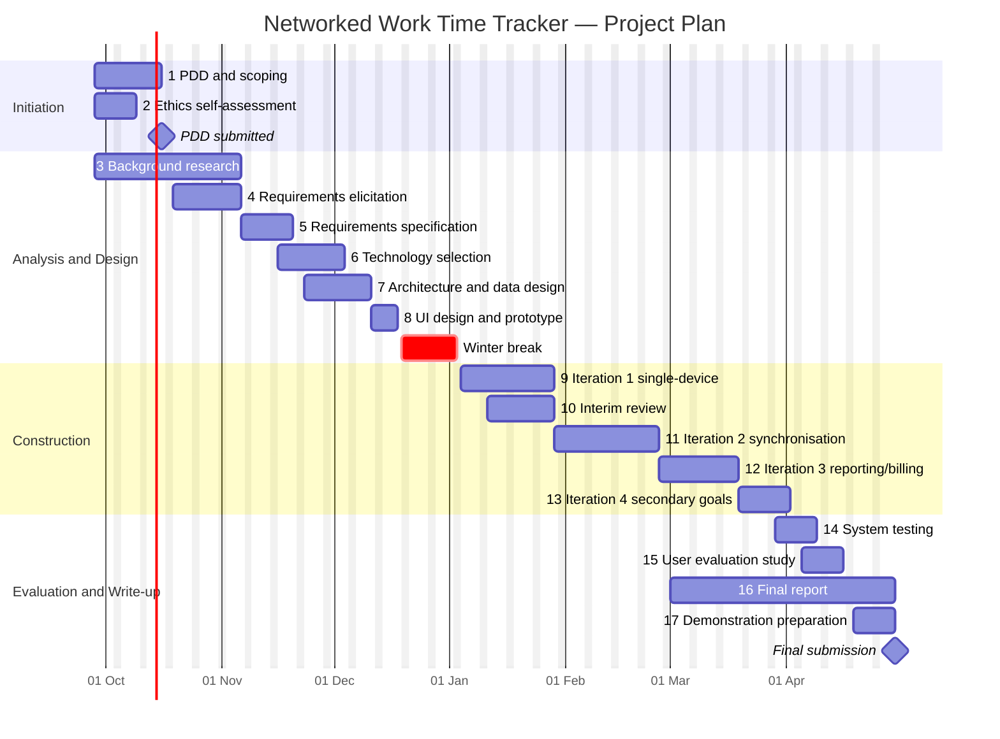

# Project Definition Document

## Networked Work Time Tracker

| | |
| --- | --- |
| **Student** | *[Name, student ID]* |
| **Programme** | *[Programme title]* |
| **Supervisor** | *[Supervisor name]* |
| **Second marker** | *[Second marker name]* |
| **Version / date** | 1.0 — 29 September 2026 |

---

## 1. Project Summary

Many people who bill clients for their time, such as freelancers, consultants, developers and agency staff, work on several projects at once and often on more than one computer. They need an accurate record of the time spent on each project so that each customer is charged only for the work done for them. Commercial time-tracking tools exist, but they share two weaknesses. They demand frequent manual input, so users stop using them. They also handle poorly a user who works on the same project from more than one location.

This project will design, build and evaluate a **networked work time tracker** that keeps the effort needed from the user to a minimum. It will record time against multiple projects across multiple computers, combine the records into one consistent history, and use that history to produce reports and bills. As a secondary goal, it will support multiple users, including several users working on one project.

---

## 2. Background and Rationale

### 2.1 The problem

Accurate time records are the basis of billing, project costing and productivity analysis in professional services. Studies of timesheet practice, and the experience of anyone who has kept one, show that time recorded after the fact is incomplete and inaccurate: people forget to start or stop timers, fill in timesheets from memory at the end of the week, and round or estimate. The result is either lost revenue (under-billing) or loss of client trust (over-billing).

Existing tools fall broadly into two groups:

- **Manual timer and timesheet tools**, where the user explicitly starts and stops a timer or enters durations. These are accurate only if the user is disciplined, and the friction of constant interaction is the main reason they are abandoned.
- **Automatic activity trackers**, which record application and document usage in the background. These reduce effort but typically record *activity* rather than *project time*, need the user to categorise data afterwards, and raise privacy concerns.

Neither group deals well with a user who moves between machines during the day, for example an office desktop, a laptop at home and a client-site computer. Records made on different devices may overlap, conflict or go missing when a device is offline.

### 2.2 Rationale

A tool that needs almost no user input, but still attributes time correctly to projects across all of a user's devices, would give more accurate records at lower cost to the user. The project is worth doing because it combines three problems that are interesting in their own right:

1. **Low-effort interaction design**: finding the least a user must do to produce billable-quality records, for example one-action project switching, sensible defaults, idle detection and prompts driven by context.
2. **Distributed data consistency**: merging time records from several intermittently connected devices into a single correct timeline, including conflict detection and resolution.
3. **Turning data into value**: producing reports and invoices that users and their customers can trust.

### 2.3 Expected benefits

| Beneficiary | Benefit |
| --- | --- |
| Individual professionals | Less time spent on administration; more complete billable hours; one view across all devices. |
| Small firms and teams | Consistent records across staff; project-level cost visibility; faster invoicing. |
| Clients | More accurate and transparent bills. |
| The developer (academic) | A substantial piece of software engineering covering usability, distributed systems and data reporting. |

---

## 3. Aims and Objectives

### 3.1 Aim

To develop and evaluate software that tracks the time a user spends on multiple projects across multiple computers, with significantly less user effort than conventional time-tracking tools, and that produces accurate reports and bills from the data collected.

### 3.2 Primary objectives

Each objective is Specific, Measurable, Achievable, Relevant and Time-bound. The completion criterion states how it will be judged complete, and the task numbers refer to the task plan in Section 7.

| ID | Objective | Completion criterion | Tasks | Target date |
| --- | --- | --- | --- | --- |
| **P1** | Produce a requirements specification based on analysis of existing tools and input from prospective users. | Specification document agreed with supervisor, containing prioritised (MoSCoW) functional and non-functional requirements. | 3–5 | 20 Nov 2026 |
| **P2** | Design a system architecture and data model that support tracking on multiple devices and later reconciliation of records. | Design document containing architecture, data model and synchronisation strategy, reviewed with supervisor. | 6–7 | 11 Dec 2026 |
| **P3** | Implement time recording for multiple projects on a single computer, with a low-effort interaction model. | A user can start, switch and stop tracking against a project in **one action or fewer** (automatic where possible); idle time is detected and handled; all related tests pass. | 9 | 29 Jan 2027 |
| **P4** | Implement synchronisation of time records between two or more computers used by the same user. | Records made on two devices, including while one is offline, are merged into one timeline with **no lost records** and with every overlap detected and resolved or flagged, as shown by scripted tests. | 11 | 26 Feb 2027 |
| **P5** | Implement reporting and billing from the collected data. | The system produces per-project and per-client time reports for any date range, and a bill/invoice based on configurable hourly rates, whose totals match the underlying records exactly. | 12 | 19 Mar 2027 |
| **P6** | Evaluate the system against its requirements and against user effort and accuracy criteria. | Evaluation (Section 12) completed and results written up in the final report. | 14–15 | 16 Apr 2027 |

### 3.3 Secondary objectives

These will be attempted once the primary objectives are met, or where they fit naturally alongside them.

| ID | Objective | Completion criterion |
| --- | --- | --- |
| **S1** | Support multiple users, and multiple users per project, with appropriate separation of each user's data. | Two or more user accounts can record time against a shared project; project-level reports combine all users' time; users cannot see or change each other's private records. |
| **S2** | Suggest or infer the current project automatically from context, such as the active application, file or folder, or network location. | In the evaluation study, automatic suggestions are accepted without correction for at least **70 %** of project switches. |
| **S3** | Provide a standalone mode in which the application runs on a single machine without a separately hosted server. | The application installs and runs on a clean machine with no external server, and all primary features except cross-device synchronisation work. |
| **S4** | Export data in common formats (e.g. CSV, PDF) for use in external accounting software. | Exported files open correctly in a standard spreadsheet and PDF viewer, with totals matching in-app reports. |

### 3.4 Expected outcomes and deliverables

1. Requirements specification (P1).
2. Design document: architecture, data model, synchronisation strategy and user-interface designs (P2).
3. Working software meeting the primary objectives, with source code under version control.
4. Automated test suite and test report.
5. Evaluation results: user study findings and technical measurements.
6. Final report, including critical reflection on methodology, tools and AI use.
7. Project demonstration.

### 3.5 How overall success will be judged

The project will be a success if all primary objectives are met and the evaluation (Section 12) shows that the system (a) needs measurably less user interaction than a conventional manual timer, (b) produces accurate time totals across devices, and (c) is rated as usable by test participants. Secondary objectives add to the quality of the result but are not required for success.

### 3.6 Programme competencies

| Competency | How the project addresses it |
| --- | --- |
| **CP1** Critical and creative problem-solving | Designing low-effort interaction and a record reconciliation strategy; critical evaluation of results. |
| **CP2** Risk, ethics and law | Risk plan (Section 9); ethical and legal analysis (Section 10), particularly around personal data and activity monitoring. |
| **CP6** Systems engineering qualities | Explicit non-functional requirements for reliability (no lost records), security (separation of user data), usability, accessibility, maintainability and scalability to multiple users/devices. |
| **CS** Applying computer science theory | Distributed data consistency and conflict resolution; data modelling; algorithms for timeline merging and idle/context detection. |

---

## 4. Scope

**In scope:** recording time against projects; low-effort interaction; operation on multiple computers belonging to one user; synchronisation and conflict handling; reporting and billing; the secondary objectives listed above.

**Out of scope:** payment processing; full accounting (tax, ledgers); payroll; mobile-native applications (unless chosen during technology selection as the best way to meet requirements); monitoring of employees without their knowledge; production deployment and ongoing hosting.

---

## 5. Constraints

| Constraint | Effect on the project |
| --- | --- |
| **Fixed deadline and time budget** | The project must be completed by the module submission date (end of April 2027) within about 400 hours of student effort. The scope is prioritised so that primary objectives are delivered first. |
| **Single developer** | All analysis, design, implementation and testing is done by one person, which limits how much functionality can be built. |
| **Minimal budget** | Only free, open-source or university-provided software and services may be used. Any cloud hosting must fit within free tiers. |
| **Available hardware** | Testing across several devices is limited to machines the student can access (personal laptop, university lab computers). Virtual machines may be used to simulate extra devices. |
| **Ethical approval** | No study involving human participants may begin until the university ethics check (and any further approval it requires) is complete. |
| **Personal data regulation** | Time and activity records are personal data. Their collection and storage must comply with UK GDPR and the Data Protection Act 2018 (see Section 10). |
| **Standalone operation** | The software must be able to run locally for demonstration and assessment without depending on a separately hosted server (objective S3). This affects architectural choices. |

In line with the module guidance, **this document does not commit to a particular programming language, framework or database.** Choosing these is part of the project (Task 6) and will follow from the requirements specification.

---

## 6. Methodology

### 6.1 Development approach

The project will use an **iterative and incremental** approach based on agile principles, adapted for a single developer. The reasons are:

- The central challenge, minimising user effort, can only be judged by putting working software in front of users. Short iterations with feedback suit this better than a plan-driven (waterfall) model.
- The requirements divide naturally into increments (single-device tracking → synchronisation → reporting → multi-user), each of which produces something usable.
- A fixed deadline with a single developer favours delivering the highest-priority features first, so that a working product exists even if later increments are cut.

The project has three phases:

1. **Analysis and design (Oct–Dec)**: research, requirements gathering, technology selection, architecture and user-interface design, and low-fidelity prototypes.
2. **Construction (Jan–Mar)**: four time-boxed iterations of 2–4 weeks, each ending with a working build, a short self-review against the iteration goals, and an update to the task backlog. Supervisor meetings each week act as iteration reviews.
3. **Evaluation and write-up (Mar–Apr)**: system testing, the user evaluation study, and the final report.

### 6.2 Research activities

- **Review of existing tools and literature**: survey competing products and published work on time tracking, automatic activity recognition, and data synchronisation techniques (for example last-writer-wins, vector clocks and conflict-free replicated data types). This work continues throughout the project and feeds the interim review.
- **Requirements elicitation**: a short online questionnaire and a small number of informal interviews with prospective users, such as students with part-time work, staff and freelancers, to find current practice, pain points and acceptable levels of automation. This needs ethical approval (Section 10).
- **Technology evaluation**: candidate technologies will be compared using weighted criteria taken from the requirements, such as cross-platform support, offline capability, ease of local deployment, the developer's familiarity, licensing and community support. The result will be recorded as a decision matrix.

### 6.3 Engineering practices and tools

- **Version control** with a remote repository, frequent commits and tagged releases at the end of each iteration.
- **Issue tracking / Kanban board** to manage the backlog and record progress.
- **Automated testing**: unit tests for core logic (especially timeline merging and billing calculations), integration tests for synchronisation, and scripted multi-device scenarios run on virtual machines.
- **Project management software** (as provided by the module) to keep the Gantt chart up to date.
- **AI tools**: any use of AI assistants will be recorded in a log as it happens and acknowledged in line with university policy and the module's AI declaration.

### 6.4 Assessing the methodology

At the end of the project, the methodology will be judged by comparing planned against actual dates for each task and iteration, by counting objectives met, and by reflecting in the final report on whether iterative delivery and the chosen tools helped or hindered progress (Section 12.3).

---

## 7. Task Plan

Durations are estimates for a project running from 28 September 2026 to 30 April 2027. Milestone dates will be aligned with the published module calendar.

| # | Task | Start | End | Depends on | Objective |
| --- | --- | --- | --- | --- | --- |
| 1 | Project initiation: meet supervisor, agree scope, write PDD | 28 Sep | 16 Oct | — | — |
| 2 | Complete and submit ethics self-assessment | 28 Sep | 09 Oct | — | — |
| 3 | Background research: existing tools, low-effort tracking, synchronisation techniques | 28 Sep | 06 Nov | — | P1 |
| 4 | Requirements elicitation: questionnaire and interviews | 19 Oct | 06 Nov | 2 | P1 |
| 5 | Write requirements specification (MoSCoW prioritised) | 09 Nov | 20 Nov | 3, 4 | P1 |
| 6 | Technology evaluation and selection (decision matrix) | 16 Nov | 04 Dec | 5 | P2 |
| 7 | Architecture, data model and synchronisation design | 23 Nov | 11 Dec | 5, 6 | P2 |
| 8 | UI design and low-fidelity prototype; informal feedback | 07 Dec | 18 Dec | 7 | P3 |
| — | *Winter break (reduced activity; buffer)* | 19 Dec | 03 Jan | — | — |
| 9 | Iteration 1: single-device tracking, low-effort interaction, idle detection | 04 Jan | 29 Jan | 7, 8 | P3 |
| 10 | Interim review: research summary informing design | 11 Jan | 29 Jan | 3 | — |
| 11 | Iteration 2: multi-device synchronisation and conflict handling | 01 Feb | 26 Feb | 9 | P4 |
| 12 | Iteration 3: reporting and billing | 01 Mar | 19 Mar | 9 | P5 |
| 13 | Iteration 4: secondary objectives (multi-user, context inference, standalone mode, export) | 22 Mar | 02 Apr | 11, 12 | S1–S4 |
| 14 | System testing and technical evaluation | 29 Mar | 09 Apr | 11, 12 | P6 |
| 15 | User evaluation study | 05 Apr | 16 Apr | 2, 14 | P6 |
| 16 | Final report writing | 01 Mar | 30 Apr | 10; results of 14, 15 | — |
| 17 | Demonstration preparation | 19 Apr | 30 Apr | 14 | — |

Tasks 13 and the second half of Task 16 contain the schedule contingency. If earlier tasks overrun, Task 13 will be reduced before any primary objective is affected.

---

## 8. Gantt Chart

The chart below shows the task plan and its dependencies. A version kept in the module's project management software will be maintained throughout the project and included in the submitted PDF.

---

## 9. Risk Assessment and Mitigation

Likelihood (L) and Impact (I) are rated 1 (low) to 3 (high). Score = L × I; scores of 6 or more are treated as high priority.

| # | Risk | L | I | Score | Mitigation (prevent) | Contingency (if it happens) |
| --- | --- | :-: | :-: | :-: | --- | --- |
| R1 | Scope too large for the time available | 2 | 3 | **6** | MoSCoW prioritisation; primary objectives built first; secondary work isolated in Task 13. | Drop or reduce secondary objectives; agree reduced scope with supervisor. |
| R2 | Multi-device synchronisation proves harder than expected (conflicts, offline edits) | 3 | 3 | **9** | Research proven approaches early (Task 3); design sync into the data model from the start (Task 7); build a minimal version first. | Fall back to a simpler strategy (e.g. append-only records with manual resolution of flagged overlaps), which still meets P4's "no lost records" criterion. |
| R3 | Chosen technology turns out to be unsuitable | 2 | 2 | 4 | Structured technology evaluation; small technical spike before committing. | Replace the affected component; a modular architecture limits the rework. |
| R4 | Too few participants for requirements or evaluation studies | 2 | 2 | 4 | Recruit early through course peers, staff and part-time workers; keep sessions short. | Use heuristic evaluation and cognitive walkthroughs as well as fewer participants; state the limitation. |
| R5 | Delay in ethical approval | 1 | 3 | 3 | Submit ethics self-assessment in week 1; design low-risk studies. | Carry out requirements work from secondary sources; postpone user study and increase technical evaluation. |
| R6 | Illness or personal circumstances cause lost time | 2 | 3 | **6** | Buffer in winter break and Task 13; steady weekly progress. | Use contingency time; apply for mitigating circumstances if needed; cut secondary scope. |
| R7 | Loss of code or documents (hardware failure, accidental deletion) | 1 | 3 | 3 | Remote version control; regular backups of documents to cloud storage. | Restore from repository/backup. |
| R8 | Lack of access to several machines for testing | 2 | 2 | 4 | Use virtual machines/containers to simulate devices; book lab machines. | Test with simulated devices only and report the limitation. |
| R9 | Automatic tracking features raise privacy objections from participants | 2 | 2 | 4 | Make automatic capture opt-in and transparent; store minimal data. | Disable the feature for affected participants; evaluate with manual mode. |
| R10 | Competing assessment deadlines from other modules | 3 | 2 | **6** | Plan around known deadlines; keep the Gantt chart current. | Shift non-critical tasks; use buffer periods. |

Risks will be reviewed at each weekly supervisor meeting and the register updated.

---

## 10. Ethical and Legal Issues

This section covers issues that arise *while carrying out* the project. Issues arising from deployment after completion are outside the PDD's scope.

### 10.1 Human participants

The requirements questionnaire/interviews (Task 4) and the evaluation study (Task 15) involve human participants. Measures:

- The university ethics self-assessment will be submitted before any participant activity, and further approval obtained if required.
- Participants will receive an information sheet and give **informed consent**. Participation is voluntary, and participants may withdraw at any time without giving a reason.
- Studies will be short, low-risk and anonymous where possible. No vulnerable groups will be recruited.
- Care will be taken to avoid pressure where participants are peers or acquaintances of the researcher.

### 10.2 Personal and activity data (UK GDPR / Data Protection Act 2018)

Time records, and especially automatically captured activity data such as application names, file names or locations, are personal data and may reveal sensitive information. During the project:

- **Data minimisation**: only data needed for the study will be collected. Where possible, participants will use **synthetic projects and test scenarios** rather than their real work.
- **Transparency and control**: automatic capture will be opt-in and visible to the user, who can review and delete records.
- **Security**: study data will be pseudonymised, stored on encrypted university-approved storage, and deleted once the project has been assessed.
- **Lawful basis**: consent, as recorded in the consent form.

### 10.3 Intellectual property and licensing

Third-party libraries and assets will be used according to their licences, and their licences and attribution will be recorded. Care will be taken that no competitor's proprietary design or code is copied.

### 10.4 Use of AI

Any use of AI tools for research, writing or code will be logged, acknowledged in line with the University's policy on student use of AI, and declared through the module's AI declaration.

### 10.5 Professional conduct

The project will follow the BCS Code of Conduct, particularly regarding the public interest (privacy), professional competence and honesty in reporting results.

---

## 11. Commercial Considerations

### 11.1 Cost of the project

| Item | Estimate |
| --- | --- |
| Developer time: ~400 hours at a notional junior developer rate of £25/hour | ~£10,000 (notional) |
| Software and tools (open-source or university-provided) | £0 |
| Hardware (existing laptop, university labs, virtual machines) | £0 |
| Hosting for synchronisation testing (free-tier cloud or local server) | £0–£50 |
| Participant incentives (optional) | £0–£50 |
| **Total cash cost** | **≤ £100** |

A commercial release would also need hosting, support, security review, code signing and marketing, with ongoing costs that depend on the number of users.

### 11.2 Market and competition

The target market is **freelancers, consultants, small agencies and professional-services teams** who bill by the hour and work on more than one device. Established competitors include manual timer tools such as Toggl Track, Clockify and Harvest; automatic trackers such as Timely and RescueTime; and developer-focused trackers such as WakaTime. The market is mature and competitive, so a new product would need a clear point of difference. The one this project targets is **very low user effort combined with reliable tracking across devices, including offline**, which the project brief identifies as the weakness of existing tools.

### 11.3 Routes to commercialisation

- **Freemium SaaS**: free for individual use on a limited number of devices, with paid tiers for teams, invoicing and integrations.
- **Self-hosted / open-core**: an open-source core with paid support or enterprise features, attractive to privacy-conscious firms that do not want activity data held by a third party.
- **Integration and licensing**: offering the synchronisation and reconciliation engine to existing practice-management or accounting products.

Any commercial route would need a full data-protection assessment and a clear privacy position, because trust about monitoring data is a key factor in this market.

---

## 12. Evaluation Plan

The criteria are set now so that the final evaluation is objective.

### 12.1 Evaluation of the product

| Criterion | Method | Target |
| --- | --- | --- |
| **Functional completeness** | Trace each requirement in the specification to a passing test or demonstration. | 100 % of "Must" requirements; ≥ 70 % of "Should" requirements. |
| **User effort** | Participants carry out a scripted working-day scenario (several project switches, one device change, one idle period) with the new system and with a conventional manual timer. Count user interactions and time spent on tracking. | Mean interactions at least **50 % lower** than the manual timer. |
| **Accuracy** | Compare recorded time with the scenario's known ground-truth timeline. | Total error ≤ **2 %** per project over the scenario. |
| **Synchronisation correctness** | Automated scenarios on 2–3 simulated devices, including offline periods and deliberately conflicting edits. | 0 lost records; 100 % of overlaps detected. |
| **Billing correctness** | Automated tests comparing generated reports and bills with independently calculated totals. | Exact match. |
| **Usability** | System Usability Scale (SUS) questionnaire after the scenario, plus short semi-structured feedback. | Mean SUS ≥ **68** (above average). |
| **Accessibility** | Check the interface against WCAG 2.2 AA using automated tools and a manual keyboard-only walkthrough. | No critical failures. |
| **Secondary objectives** | Criteria as defined in Section 3.3. | As stated. |

### 12.2 Evaluation of design choices

The technology decision matrix and architecture decisions will be revisited at the end of the project. For each major decision (for example the synchronisation strategy or the data model), the final report will assess whether it met the requirements it was chosen for, what problems it caused, and what would be done differently.

### 12.3 Evaluation of the methodology and tools

- Planned against actual dates for each task and iteration, taken from the maintained Gantt chart.
- Proportion of planned backlog items completed in each iteration.
- Reflection on whether iterative development, user involvement and the chosen tools (including AI tools) contributed to the outcome, supported by the project log and supervisor meeting notes.

---

## 13. References

- British Computer Society (2022) *BCS Code of Conduct*. Swindon: BCS.
- Brooke, J. (1996) 'SUS: A "quick and dirty" usability scale', in Jordan, P. W. et al. (eds.) *Usability Evaluation in Industry*. London: Taylor & Francis, pp. 189–194.
- Shapiro, M., Preguiça, N., Baquero, C. and Zawirski, M. (2011) 'Conflict-free replicated data types', *Proceedings of the 13th International Symposium on Stabilization, Safety, and Security of Distributed Systems (SSS 2011)*, pp. 386–400.
- University of Hull (n.d.) *Student Use of AI*. Available at: https://www.hull.ac.uk/asset-library/docs/student-use-of-ai.pdf.
- W3C (2023) *Web Content Accessibility Guidelines (WCAG) 2.2*. Available at: https://www.w3.org/TR/WCAG22/.
- UK Government (2018) *Data Protection Act 2018*. Available at: https://www.legislation.gov.uk/ukpga/2018/12.
